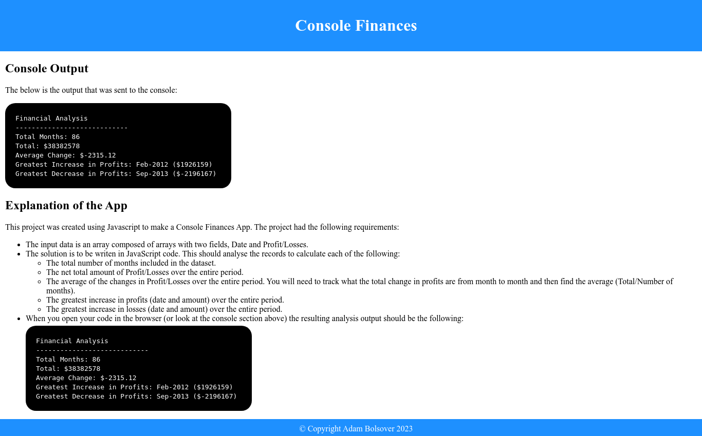

# Bootcamp Project 4 - Console Finances

## Description 

This project was created using Javascript to make a Console Finances App. The project had the following requirements:

* The input data is an array composed of arrays with two fields, Date and Profit/Losses.
* The solution is to be writen in JavaScript code. This should analyse the records to calculate each of the following:
    * The total number of months included in the dataset.
    * The net total amount of Profit/Losses over the entire period.
    * The average of the changes in Profit/Losses over the entire period. You will need to track what the total change in profits are from month to month and then find the average (Total/Number of months).
    * The greatest increase in profits (date and amount) over the entire period.
    * The greatest increase in losses (date and amount) over the entire period.

* When you open your code in the browser your resulting analysis should look similar to the following:

    ```
    Financial Analysis
    ----------------------------
    Total Months: 25
    Total: $2561231
    Average  Change: $-2315.12
    Greatest Increase in Profits: Feb-2012 ($1926159)
    Greatest Decrease in Profits: Sep-2013 ($-2196167)
    ```

The page in this repo is the result.

## Installation

The site does not require installation steps.

## Usage 

The website can be viewed at [https://bowseruk.github.io/console-finances/](https://bowseruk.github.io/console-finances/) with Google Chrome. The source can be viewed in Chrome by right clicking and selecting inspect.



## Credits

This site was based on a project by edX Boot Camps LLC.

[W3School](https://www.w3schools.com/) was used as a reference for elements to use and good practice.

The changes were checked with [W3C Validator](https://validator.w3.org/).

[Stack Overflow](https://stackoverflow.com/) always seems to have the answer to a problem that occurs.


## License

This project uses the licence in the LICENCE file of the repo.